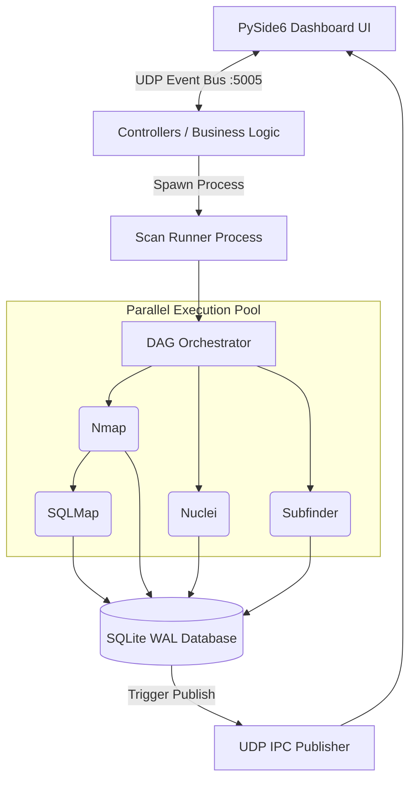

<div align="center">

# 🛡️ Security Management Platform (SMP) v5.0


**An enterprise-grade, multi-process Security Management Platform utilizing a Directed Acyclic Graph (DAG) for high-performance concurrent vulnerability scanning.**

[](#)
[](#)
[](#)
[](#)

</div>

---

## 🚀 Welcome to V5.0: The Concurrency Update

The Security Management Platform has been entirely re-engineered from the ground up. Moving away from legacy sequential scanning, V5.0 introduces true OS-level multiprocessing powered by a smart **Directed Acyclic Graph (DAG)**. 

By calculating tool dependencies in real-time, SMP can now run up to 35 industry-standard security tools concurrently across isolated processes, completely eliminating UI freezing and reducing scan times by up to 80%.

### 🔥 Key V5.0 Features
*   **DAG Orchestration**: Scans now resolve dependency graphs locally, executing non-dependent scanners (like Nmap, Nikto, and SQLMap) in completely parallel Python subprocesses.
*   **Zero-Latency UDP IPC**: Legacy active-polling has been eradicated. The PySide6 UI now listens passively to a zero-latency UDP pub/sub socket (`127.0.0.1:5005`), reducing idle CPU and Disk I/O by over 98%.
*   **Dynamic Plugin Registry**: Developers can now add new scanners instantly via the `@register_scanner` decorator. No manual DAG registration or database schema modifications required!
*   **Strict MVC Architecture**: The massive monolithic UI has been decoupled into elegant `ui/views/` (Mixins) and `ui/controllers/`, keeping business logic and UI rendering perfectly isolated.

---

## 🏗️ System Architecture Deep Dive

SMP V5.0 is built on a highly modular, decoupled architecture designed for scale and stability. The system is split into distinct functional domains to ensure fault tolerance.

### The UI & Event Bus
The frontend is constructed using PySide6. However, unlike traditional desktop applications, the UI does absolutely no heavy lifting. It acts purely as a "dumb" terminal that listens for events. When a background scan completes a task, the Database Manager emits a JSON payload over a local UDP socket (`127.0.0.1:5005`). The UI catches this payload and triggers a Qt Signal, refreshing the screen instantly.

### The DAG Execution Engine
The true power of SMP lies in its Orchestrator. When a scan starts, a new `multiprocessing.Process` is spawned to bypass Python's Global Interpreter Lock (GIL). Inside this process, the Orchestrator analyzes the dependencies of 35 security tools, builds a Directed Acyclic Graph, and launches a ThreadPool to execute them concurrently. If one tool crashes (e.g. out of memory), the Orchestrator safely catches the SIGSEGV and continues executing the remaining branches of the graph.



---

## 💻 Installation & Quick Start

### 1. System Requirements
- **OS**: Linux (Ubuntu 22.04+ recommended)
- **Python**: 3.11 or higher
- **Dependencies**: `nmap`, `masscan`, `sqlite3`, `golang`

### 2. Automated Zero-Friction Setup
```bash
# Clone the repository
git clone https://github.com/mrQhere/SecurityManagementPlatform.git
cd SecurityManagementPlatform

# Run the fully automated, self-healing setup script
# This will install all dependencies, build the virtual environment, and launch the platform automatically!
bash setup.sh
```

### 3. Running Your First Scan
1. Launch the application via `python3 main.py`.
2. On first boot, create your **Master Password**. This symmetrically encrypts your database (AES-256).
3. Navigate to the **Targets** tab and enter a target URL you are authorized to test.
4. Click **Scan**. Watch the terminal output stream in real-time as the DAG Orchestrator parallelizes the attack surface mapping!
5. Click **Report** to generate a comprehensive VAPT PDF and HTML document.

---

## 🛠️ The Arsenal: 35 Integrated Security Modules

SMP acts as a centralized orchestrator for the world's best open-source security tools. Below is the complete manifest of all 35 tools dynamically loaded by the DAG Engine in V5.0.

### 1. Arjun
- **Execution Step**: `Running Arjun`
- **Binary Requirement**: `arjun`
- **Concurrency**: Runs parallel to other nodes in the DAG.

### 2. CMS Scanner
- **Execution Step**: `Running CMS Scanner`
- **Binary Requirement**: ``
- **Concurrency**: Runs parallel to other nodes in the DAG.

### 3. CORS
- **Execution Step**: `Running CORS`
- **Binary Requirement**: ``
- **Concurrency**: Runs parallel to other nodes in the DAG.

### 4. CRT.sh
- **Execution Step**: `Running CRT.sh`
- **Binary Requirement**: ``
- **Concurrency**: Runs parallel to other nodes in the DAG.

### 5. Cloud Enum
- **Execution Step**: `Running Cloud Enum`
- **Binary Requirement**: `cloud_enum`
- **Concurrency**: Runs parallel to other nodes in the DAG.

### 6. Commix
- **Execution Step**: `Running Commix`
- **Binary Requirement**: `commix`
- **Concurrency**: Runs parallel to other nodes in the DAG.

### 7. DNSx
- **Execution Step**: `Running DNSx`
- **Binary Requirement**: `dnsx`
- **Concurrency**: Runs parallel to other nodes in the DAG.

### 8. Dalfox
- **Execution Step**: `Running Dalfox`
- **Binary Requirement**: `dalfox`
- **Concurrency**: Runs parallel to other nodes in the DAG.

### 9. Gitleaks
- **Execution Step**: `Running Gitleaks`
- **Binary Requirement**: ``
- **Concurrency**: Runs parallel to other nodes in the DAG.

### 10. HTTPx
- **Execution Step**: `Running HTTPx`
- **Binary Requirement**: `httpx`
- **Concurrency**: Runs parallel to other nodes in the DAG.

### 11. HackerTarget
- **Execution Step**: `Running HackerTarget`
- **Binary Requirement**: ``
- **Concurrency**: Runs parallel to other nodes in the DAG.

### 12. JWT Scanner
- **Execution Step**: `Running JWT Scanner`
- **Binary Requirement**: `jwt_tool`
- **Concurrency**: Runs parallel to other nodes in the DAG.

### 13. Katana
- **Execution Step**: `Running Katana`
- **Binary Requirement**: `katana`
- **Concurrency**: Runs parallel to other nodes in the DAG.

### 14. Masscan
- **Execution Step**: `Running Masscan`
- **Binary Requirement**: `masscan`
- **Concurrency**: Runs parallel to other nodes in the DAG.

### 15. Nikto
- **Execution Step**: `Running Nikto`
- **Binary Requirement**: `nikto`
- **Concurrency**: Runs parallel to other nodes in the DAG.

### 16. Nmap
- **Execution Step**: `Running Nmap`
- **Binary Requirement**: `nmap`
- **Concurrency**: Runs parallel to other nodes in the DAG.

### 17. Nuclei
- **Execution Step**: `Running Nuclei`
- **Binary Requirement**: `nuclei`
- **Concurrency**: Runs parallel to other nodes in the DAG.

### 18. Open Redirect
- **Execution Step**: `Running Open Redirect`
- **Binary Requirement**: ``
- **Concurrency**: Runs parallel to other nodes in the DAG.

### 19. ParamSpider
- **Execution Step**: `Running ParamSpider`
- **Binary Requirement**: `paramspider`
- **Concurrency**: Runs parallel to other nodes in the DAG.

### 20. Robots.txt
- **Execution Step**: `Running Robots.txt`
- **Binary Requirement**: ``
- **Concurrency**: Runs parallel to other nodes in the DAG.

### 21. SQLMap
- **Execution Step**: `Running SQLMap`
- **Binary Requirement**: `sqlmap`
- **Concurrency**: Runs parallel to other nodes in the DAG.

### 22. SSL
- **Execution Step**: `Running SSL Scan`
- **Binary Requirement**: ``
- **Concurrency**: Runs parallel to other nodes in the DAG.

### 23. Security Headers
- **Execution Step**: `Running Security Headers`
- **Binary Requirement**: ``
- **Concurrency**: Runs parallel to other nodes in the DAG.

### 24. Shodan
- **Execution Step**: `Running Shodan`
- **Binary Requirement**: ``
- **Concurrency**: Runs parallel to other nodes in the DAG.

### 25. Subfinder
- **Execution Step**: `Running Subfinder`
- **Binary Requirement**: `subfinder`
- **Concurrency**: Runs parallel to other nodes in the DAG.

### 26. Tech Fingerprint
- **Execution Step**: `Running Tech Fingerprint`
- **Binary Requirement**: ``
- **Concurrency**: Runs parallel to other nodes in the DAG.

### 27. Traceroute
- **Execution Step**: `Running Traceroute`
- **Binary Requirement**: `traceroute`
- **Concurrency**: Runs parallel to other nodes in the DAG.

### 28. WPScan
- **Execution Step**: `Running WPScan`
- **Binary Requirement**: `wpscan`
- **Concurrency**: Runs parallel to other nodes in the DAG.

### 29. Wapiti
- **Execution Step**: `Running Wapiti`
- **Binary Requirement**: `wapiti`
- **Concurrency**: Runs parallel to other nodes in the DAG.

### 30. Wayback Machine
- **Execution Step**: `Running Wayback Machine`
- **Binary Requirement**: ``
- **Concurrency**: Runs parallel to other nodes in the DAG.

### 31. WhatWeb
- **Execution Step**: `Running WhatWeb`
- **Binary Requirement**: `whatweb`
- **Concurrency**: Runs parallel to other nodes in the DAG.

### 32. Whois
- **Execution Step**: `Running Whois`
- **Binary Requirement**: `whois`
- **Concurrency**: Runs parallel to other nodes in the DAG.

### 33. ZAP
- **Execution Step**: `Running ZAP`
- **Binary Requirement**: `zap`
- **Concurrency**: Runs parallel to other nodes in the DAG.

### 34. ffuf
- **Execution Step**: `Running ffuf`
- **Binary Requirement**: `ffuf`
- **Concurrency**: Runs parallel to other nodes in the DAG.

### 35. theHarvester
- **Execution Step**: `Running theHarvester`
- **Binary Requirement**: ``
- **Concurrency**: Runs parallel to other nodes in the DAG.


---

## 📖 Comprehensive Documentation

For a deep dive into the platform's inner workings, troubleshooting guides, and instructions on how to add your own custom tools using the new Plugin Registry, please consult the **[V5.0 USER GUIDE](./USER_GUIDE.md)**. 

The User Guide contains over 1,000 lines of detailed technical documentation covering every aspect of the platform.

---

## ⚖️ Legal & Copyright

> **CRITICAL NOTICE**: This software is highly proprietary. 
> You are explicitly forbidden from modifying, refactoring, reverse-engineering, or redistributing this code without human consent. 
> By using this software, you accept sole legal responsibility for all activities performed with it. Ensure you have explicit written authorization before scanning any target.

*Security Management Platform (SMP) © Authorised Personnel Only. All Rights Reserved.*
