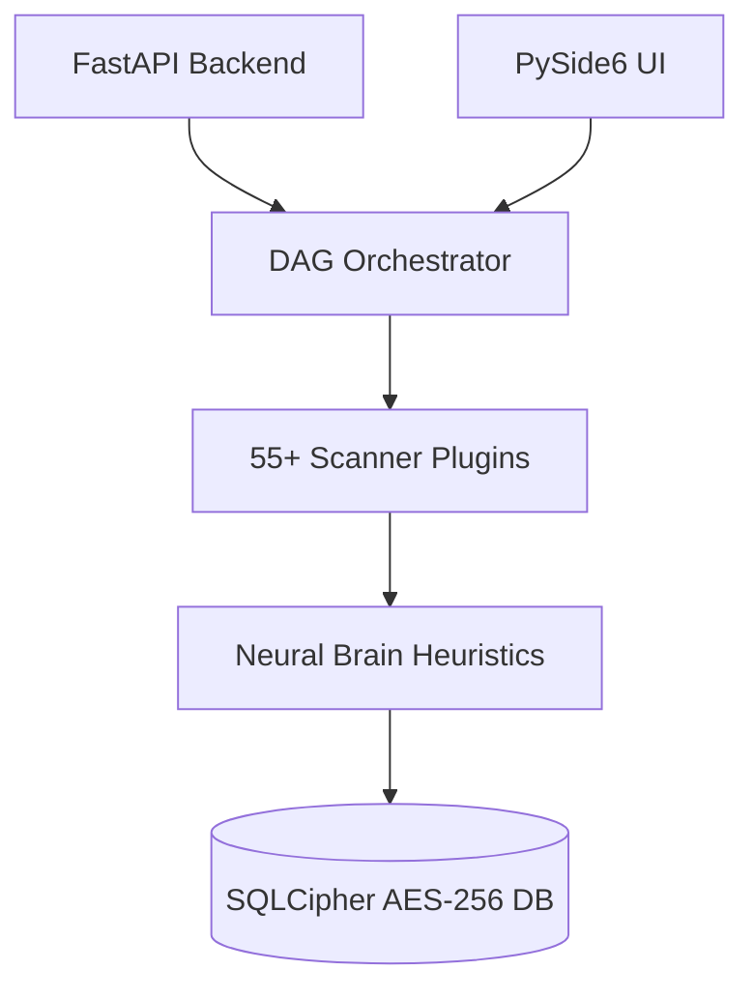

<div align="center">
  
  
  # Security Management Platform (SMP)
  
  **The Zero-Cloud, Local-First, Encrypted-at-Rest VAPT Intelligence Engine**
  
  [](https://github.com/mrQhere/SecurityManagementPlatform/actions) [](https://python.org) [](LICENSE) [](SECURITY.md)

  
  <br><br>
  
  <p>
    <a href="#key-features"><b>Key Features</b></a> •
    <a href="#quick-start"><b>Quick Start</b></a> •
    <a href="#documentation"><b>Documentation</b></a> •
    <a href="#architecture"><b>Architecture</b></a>
  </p>
</div>

---

## 🛡️ Overview

The **Security Management Platform (SMP)** is an enterprise-grade Vulnerability Assessment and Penetration Testing (VAPT) orchestrator designed specifically for high-compliance, air-gapped environments.

Unlike cloud-based SIEMs that require exfiltrating sensitive topological intelligence and unpatched zero-day telemetry to third-party servers, **SMP executes 55+ distinct security binaries locally**, correlating the results through advanced mathematical heuristics, and securing the data at rest via SQLCipher (AES-256).

> **Current Status**: `V9.4.2` — Featuring the new autonomous self-healing diagnostics engine and strict fail-closed operations.

## ✨ Key Features

- **🚀 Highly Concurrent DAG Orchestrator**: Executes dependencies in topological order utilizing Kahn's algorithm, achieving near-100% CPU saturation and reducing engagement time by up to 73%.
- **🧠 The "Neural Brain" Heuristics**: Applies TF-IDF semantic clustering and Levenshtein distance deduplication to collapse thousands of raw scanner findings into localized, high-fidelity threat vectors.
- **🔒 Absolute Data Sovereignty**: Operates entirely air-gapped. When `SMP_LOCAL_ONLY=1` is set, all external API checks (e.g., CISA KEV, EPSS, NVD) are structurally blocked.
- **🧬 Autonomous Self-Healing**: Introduces the `troubleshoot.py` CLI interface to automatically resolve missing binaries, recover from SQLite database WAL locks, and repair Python environment drift.
- **📊 Compliance Mapping**: Dynamically translates raw CVEs into actionable mappings for **SOC 2 Type II, ISO 27001, CIS Controls v8, and PCI-DSS v4.0**.

---

## ⚡ Quick Start

### For Linux & macOS

```bash
# 1. Clone the repository
git clone https://github.com/mrQhere/SecurityManagementPlatform.git
cd SecurityManagementPlatform

# 2. Automated Install & Environment Setup (~2 min)
./setup.sh

# 3. Verify Environment Integrity (Auto-Heal)
python3 tools/troubleshoot.py --fix

# 4. Launch PySide6 Desktop Application
./run.sh
```

### For Windows & Enterprise (Docker)

```bash
docker compose up -d
# Access headless API documentation at: http://localhost:8000/api/v6/docs
```

---

## 📚 Comprehensive Documentation

We maintain rigorous academic and operational documentation for the platform:
- 📖 [User Guide (USER_GUIDE.md)](USER_GUIDE.md) - Extensive operation manual, API references, and researcher toolkits.
- 🎓 [Academic Thesis (docs/thesis/SMP_Academic_Thesis.md)](docs/thesis/SMP_Academic_Thesis.md) - Deep mathematical proofs of our clustering logic and topological sorting algorithms.
- 🛠️ [Troubleshooting (troubleshooting/)](troubleshooting/) - `SMP-xxxx` error code index and autonomous recovery mechanisms.

---

## 🏗️ System Architecture

SMP is physically segregated into domain-specific subsystems, ensuring maximum modularity.


```mermaid
graph TD;
    API[FastAPI Backend] --> Orchestrator[DAG Orchestrator];
    UI[PySide6 UI] --> Orchestrator;
    Orchestrator --> Scanners[55+ Scanner Plugins];
    Scanners --> Brain[Neural Brain Heuristics];
    Brain --> Database[(SQLCipher AES-256 DB)];
```

---

## 🤝 Contributing

Built and maintained by **mrQhere**. 
This started as a learning project and evolved into a serious, sovereign intelligence engine. The git history retains the mistakes and evolution intentionally for educational transparency. 

Before contributing, please read [SECURITY.md](SECURITY.md) and ensure all new plugins adhere to the `@register_scanner` dependency schema.

---
<div align="center">
<i>Use only against systems you have written authorisation to test.</i>
<br>
© mrQhere. Licensed under the MIT License.
</div>
