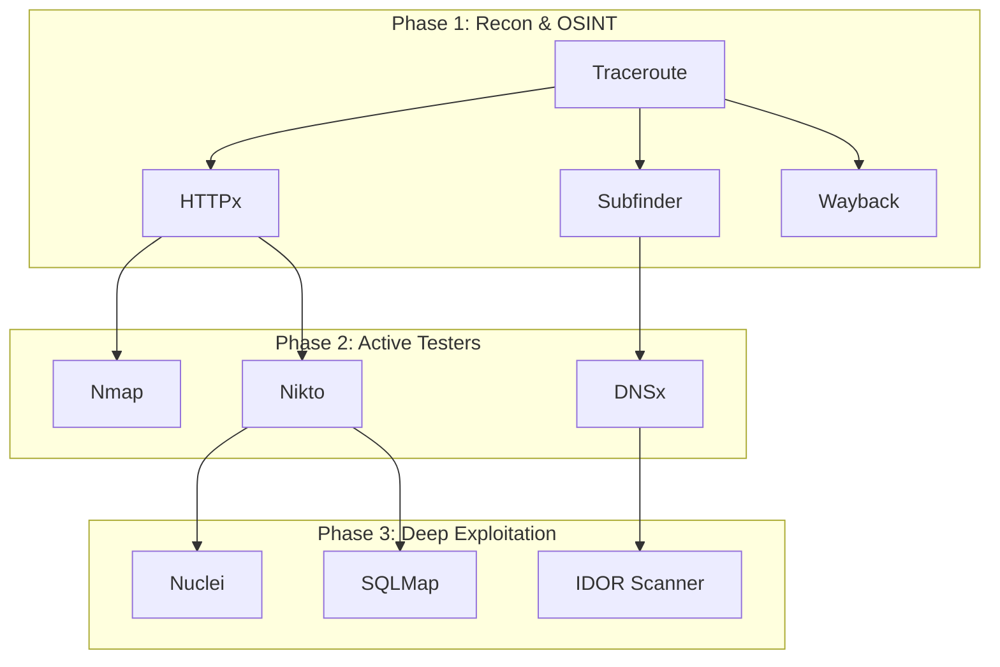
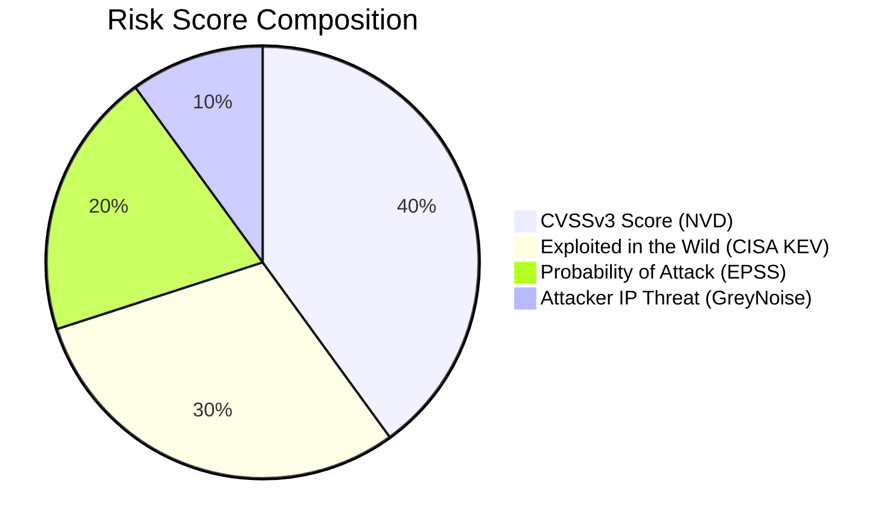

```text
╔══════════════════════════════════════════════════════════════════════╗
║                                                                      ║
║    ███████╗███╗   ███╗██████╗                                        ║
║    ██╔════╝████╗ ████║██╔══██╗                                       ║
║    ███████╗██╔████╔██║██████╔╝   Security Management Platform        ║
║    ╚════██║██║╚██╔╝██║██╔═══╝   V9.4.3 · Stable                      ║
║    ███████║██║ ╚═╝ ██║██║                                            ║
║    ╚══════╝╚═╝     ╚═╝╚═╝        © mrQhere                           ║
║                                                                      ║
║    Local-first  ·  55 Scanners  ·  AES-256  ·  Zero Cloud            ║
║                                                                      ║
╚══════════════════════════════════════════════════════════════════════╝
```

<div align="center">

# Security Management Platform

**Local-first VAPT orchestration. Zero cloud. Encrypted at rest.**

*© mrQhere · [github.com/mrQhere/SecurityManagementPlatform](https://github.com/mrQhere/SecurityManagementPlatform)*

[](https://github.com/mrQhere/SecurityManagementPlatform/actions/workflows/ci.yml)


</div>

---

# Part 1: The Basics

## 1. What is SMP?
The **Security Management Platform (SMP)** is an automated vulnerability scanner that acts like a robot penetration tester. It points 55 different security tools at a website, analyzes the results using artificial intelligence, and creates a professional PDF report. 

> [!TIP]
> **Why use SMP?** It does not upload any of your data to the cloud. Everything stays on your local machine, and your data is heavily encrypted.

## 2. Quick Start
Get up and running in less than two minutes:

```bash
# 1. Download the platform
git clone https://github.com/mrQhere/SecurityManagementPlatform.git
cd SecurityManagementPlatform

# 2. Install it automatically
./setup.sh

# 3. Launch the visual dashboard
./run.sh
```

**How to run your first scan:**
1. Click **Add Target** and enter a website URL.
2. Select the `standard` profile.
3. Click **Start Scan** and watch the Live Monitor.
4. When finished, find your PDF report in the `reports/pdf/` folder.

> [!IMPORTANT]
> **Antivirus Blocking the Installation?** Run `./setup.sh --skip-tools`. You can then manually download the required tools.

## 3. Detailed Installation

Depending on your operating system, follow these steps:

### Linux & macOS
The automated script handles almost everything:
```bash
./setup.sh
```

### Windows (Via Docker)
Because the graphical interface only works natively on Linux/Mac, Windows users must use Docker.
1. Install [Docker Desktop](https://docs.docker.com/desktop/install/windows-install/).
2. Run `docker compose up -d` in your terminal.
3. Open your browser to `http://localhost:8000/api/v6/docs` to use the API.

---

# Part 2: Operating the Platform

## 4. Scan Profiles
When you start a scan, you must choose a "Profile". Think of this as how aggressive you want the scan to be.

| Profile | What it does | When to use it |
|---------|-------------|----------------|
| **OSINT** | Only looks at public information without sending attack traffic. | When you want a quick, silent overview. |
| **Standard** | Scans for vulnerabilities actively but does NOT exploit them. | Routine security checks and compliance. |
| **Full** | Launches intrusive exploits (like trying to guess passwords). | **Only when you have written legal permission.** |

> [!WARNING]
> The `full` profile will actively try to hack the target. Using it without explicit written authorization is illegal.

## 5. Reports & Compliance
Every time a scan finishes, SMP automatically generates three things:
1. **PDF Report:** A polished document ready to hand to a client or auditor (found in `reports/pdf/`).
2. **HTML Report:** A web version of the PDF.
3. **SBOM:** A "Software Bill of Materials" that lists all the underlying technologies found.

**Compliance:** Your findings are automatically mapped to major security frameworks like **OWASP Top 10**, **ISO 27001**, and **PCI-DSS**. This helps you prove to auditors that you are compliant.

---

# Part 3: Under the Hood (Technical)

For those wanting to understand the deep technical architecture of SMP, this section breaks down the core engines.

## 6. The Directed Acyclic Graph (DAG) Architecture
SMP does not run its 55 tools one-by-one. It uses a mathematical structure called a **Directed Acyclic Graph (DAG)** to run them simultaneously in organized phases.



**What this means for you:** The platform is incredibly fast. Instead of waiting for one tool to finish, it runs multiple tools at the exact same time, only waiting when one tool needs data from another.

## 7. The Intelligence Engine & Risk Scoring
When a vulnerability is found, SMP doesn't just guess how dangerous it is. It connects to four global threat databases to calculate a highly accurate **Risk Score**.



> [!NOTE]
> If you are on an isolated network (Air-Gapped), you can run SMP in Local-Only mode (`SMP_LOCAL_ONLY=1 ./run.sh`), which stops the system from making outbound internet calls.

## 8. Cryptographic Encryption
Security platforms hold highly sensitive data (like where your vulnerabilities are). SMP encrypts all client data using **SQLCipher AES-256**. 
- **The Key:** Your master password is hashed using PBKDF2-HMAC-SHA256. 
- **Recovery:** There is no "forgot password" button. If you lose your password, your data is cryptographically unrecoverable.

---

# Part 4: Advanced Researcher Topics

This section is for developers, security engineers, and SIEM administrators integrating SMP into enterprise environments.

## 9. Automated Troubleshooting & Self-Healing
If a component crashes, do not manually debug it. V9.4.3 includes an autonomous Self-Healing Engine.
```bash
source venv/bin/activate
python3 tools/troubleshoot.py --fix
```
The engine resolves `SMP-xxxx` taxonomy errors automatically (e.g., `SMP-3001` Database Locks, `SMP-2001` Missing Dependencies). For deeper edge cases, see the `troubleshooting/` directory.

## 10. Headless REST API (V6)
SMP can be orchestrated entirely via headless REST APIs for CI/CD pipelines.
Base URL: `http://localhost:8000/api/v6/`

```bash
# 1. Get Authentication Token
TOKEN=$(curl -s -X POST http://localhost:8000/api/v6/auth/token   -H "Content-Type: application/json"   -d '{"username":"admin","password":"your_password"}' | jq -r .access_token)

# 2. Trigger a Scan
curl -X POST http://localhost:8000/api/v6/target   -H "Authorization: Bearer $TOKEN"   -d '{"url":"https://example.com"}'
```

## 11. Creating Custom Scanners (Zero-Config Plugins)
You can inject custom Python exploit scripts directly into the DAG pipeline without editing the core engine. Generate a template using:
```bash
python3 tools/create_scanner.py --name "MyTool" --binary "mytool" --severity High
```
Implement your logic in `scanners/mytool.py` using the `@register_scanner` decorator. The DAG will automatically topological-sort it into the execution pipeline on the next run.

## 12. Evolutionary Brain & Genetic Breeding (Experimental Roadmap)
SMP lays the groundwork for an **Evolutionary Machine Learning Correlation Engine**. Instead of relying on static TF-IDF heuristic weights, the platform can treat scanner confidence scores and CISA multipliers as "chromosomes." 

By simulating genetic crossover and mutation against a Ground Truth dataset, local air-gapped instances of SMP will eventually self-optimize and breed highly accurate heuristics without cloud telemetry.

---

<div align="center">

**Security Management Platform**  
Local-first · Zero-cloud · Encrypted at rest  
© mrQhere · [GitHub Repository](https://github.com/mrQhere/SecurityManagementPlatform)

</div>
